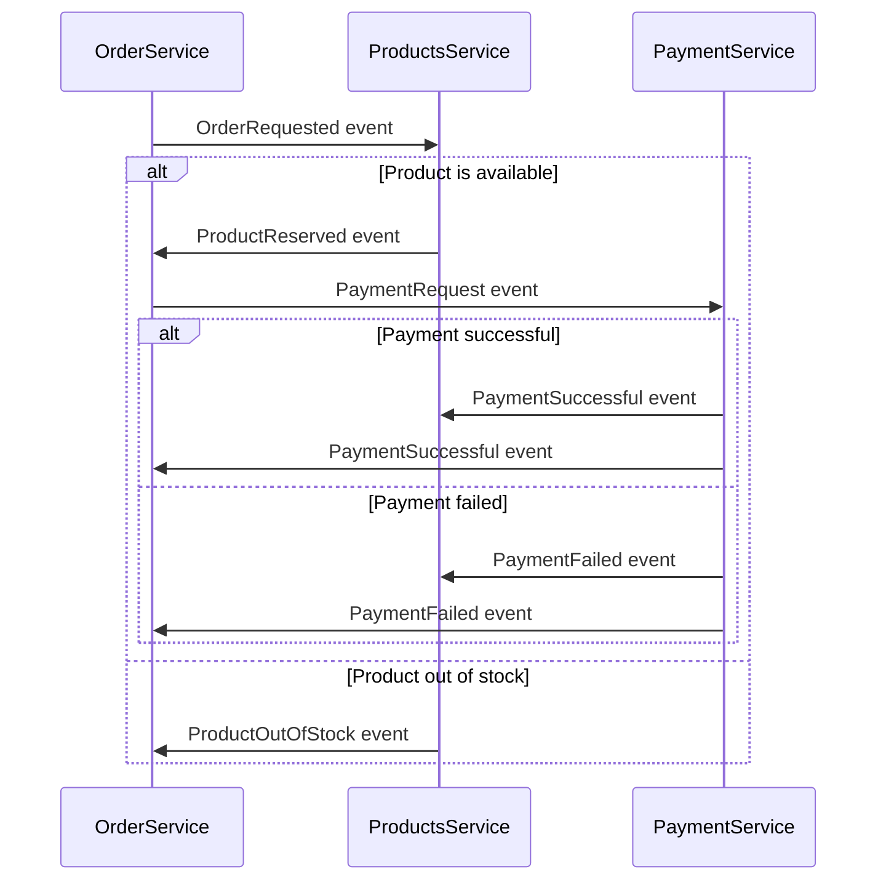

# Onyx Products Api

The tests that validate this api can be run either via docker compose or directly via the test projects.

## Running tests via docker compose

This is the recommended method. You first need to create a `.env` file using the `.env.sample` and then simply run as follows:

```bash
docker compose up --build tests
```

The rendered logs should provide the test results for the tests, after which the command should exit with code `0`.

## Running tests directly via project files

The pre-requisite to use this method is dotnet 8. To run the tests, open _this_ folder in two terminals and start the api in the first one as follows:

```bash
export ASPNETCORE_ENVIRONMENT=Development
export ASPNETCORE_URLS=http://localhost:5271
dotnet run --no-launch-profile --project src/Onyx.ProductsApi
```

Once the api is up and running, kick off the tests in the second terminal as follows:

```bash
export API_PATH=http://localhost:5271
export JWT_TOKEN=$(cd src/Onyx.ProductsApi;dotnet user-jwts create --audience "http://localhost:5271" -o token)
dotnet test src/Onyx.ProductsApi.Tests
```

The rendered logs should provide the test results, after which the command should exit with code `0`.

# Sample microservice event-driven architecture

It is generally the case that each microservice has its own database and thus maintains its own data. However, when two or more microservices interact with each other, the issue of data consistency arises.

Enter the event-driven, eventually consistent approach. Here each service publishes an event each time an update occurs. Here is an example.

-   When a consumer requests an order, the `OrderService` creates an order in _requested_ state and publishes an `OrderRequested` event
-   The `ProductsService` receives this event and attempts to reserve the requested amount. It then publishes an `ProductReserved` or `ProductOutOfStock` event
-   The `OrderService` receives this event and changes the state of the order to _pending payment_ or _out of stock_. It then publishes a `PaymentRequest` if the item was available
-   The `PaymentService` receives the `PaymentRequest` event and attempts to complete the payment. It then publishes a `PaymentSuccessful` or `PaymentFailed` event that is received by both the `OrderService` and `ProductsService`

The equivalent of this is described in this sequence diagram



Some of the positives of this pattern is that:

-   It allows for consistency across multiple services without use of transactions.
-   It is eventually consistent, even when errors occur

Some of the negatives of this pattern is that:

-   It can get complex quickly if not well thought out
-   If idempotency is not maintained then it breaks down quickly
